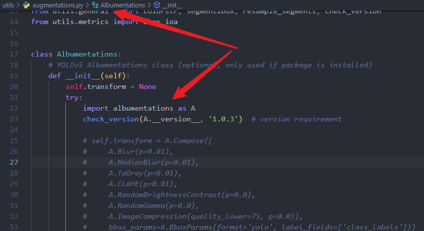
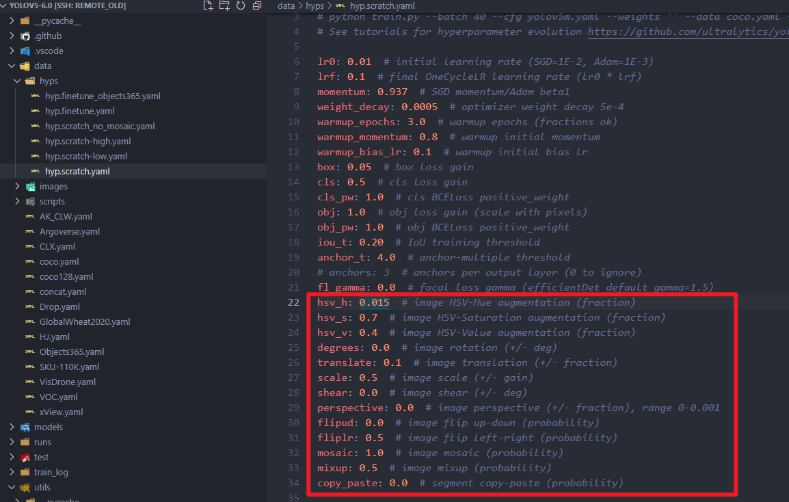
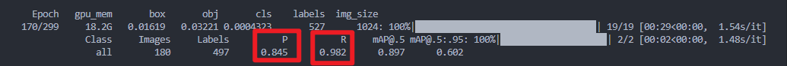
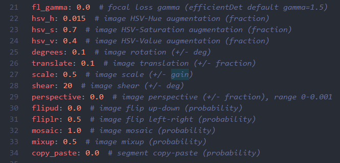
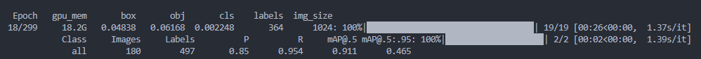

# Yolov5 数据增强

## 1、为什么要数据增强

目标检测：yolo，通过标注好的训练数据，去训练模型，尽可能正确地预测测试集的物体位置及类别信息。

如何达到此目的：

* 数据量足够大，可以囊括未来会遇到的诸多情况。

那么如果说我们的数据有限呢？

可以根据计算机视觉基础算法，处理数据，即扩充数据。

## 2、如何做数据增强

Yolo的生态已经做的很好了，它所使用的数据增强的方法有两种。

1. 使用albumentations 的数据增强，
   在 **yolov5-6.0/utils/augmentations.py** 中，albumentation包 类似于torchvision的数据增强库，功能十分强大。需要花费一些时间学习，这里不以赘述。推荐初学者使用第二种数据增强方法。

   
2. 封装较完全的数据增强：
   在 **yolov5-6.0/data/hyps/hyp.scratch.yaml**文件
   

在使用上面的数据增强参数对我的两千张数据进行训练，第170轮结果如下。

而我们的精确度（P）和召回率（R）均要求是在0.9以上。高召回率低准确率，说明，许多预测结果是不正确的，出现了很多误报的情况。说明我们检测了许多不是目标的结果。



使用数据增强可缓解这一情况，其会在训练集的每张照片应用此方法。不会在测试集上应用。

## 3、具体操作数据增强

```yaml
hsv_h: 0.015  # image HSV-Hue augmentation (fraction)
hsv_s: 0.7  # image HSV-Saturation augmentation (fraction)
hsv_v: 0.4  # image HSV-Value augmentation (fraction)
degrees: 0.0  # image rotation (+/- deg)
translate: 0.1  # image translation (+/- fraction)
scale: 0.5  # image scale (+/- gain)
shear: 0.0  # image shear (+/- deg)
perspective: 0.0  # image perspective (+/- fraction), range 0-0.001
flipud: 0.0  # image flip up-down (probability)
fliplr: 0.5  # image flip left-right (probability)
mosaic: 1.0  # image mosaic (probability)
mixup: 0.5  # image mixup (probability)
copy_paste: 0.0  # segment copy-paste (probability)

```

”数据增强方法：数值 # 方法的意义（数值所表示的意义）“

### 对于目标检测

hsv_h调整色相的百分比

hsv_s调整饱和度的百分比

hsv_v调整明度的百分比

degrees旋转的角度

translate: 图像平移的百分比

scale: 放缩的倍数

shear:  图像按轴错切的角度（一个矩形拉伸成平行四边形）比如20°

perspective: 0.0  透明度

flipud: 0.0  上下翻转数据增强的概率

fliplr: 0.5  左右翻转数据增强的概率

mosaic：马赛克形式拼接多个样本

mixup: 我称之为鬼影拼接，mixup只有在使用mosaic的条件下才会生效



对于我自己的数据集调参。这个focal loss 虽会导致训练慢一些，也可以尝试使用哈

结果如下：



对于不同的数据集需要自己去调参。可能会让结果更好，也可能更差。可以先用这个yaml文件完成任务，在具体学习Torchvision或者albumentations库。这样准确率会更高。亦可写在简历中，毕竟我们不能只当一名调参下，对不对鸭！

准确率还不够我要继续调参去了！
